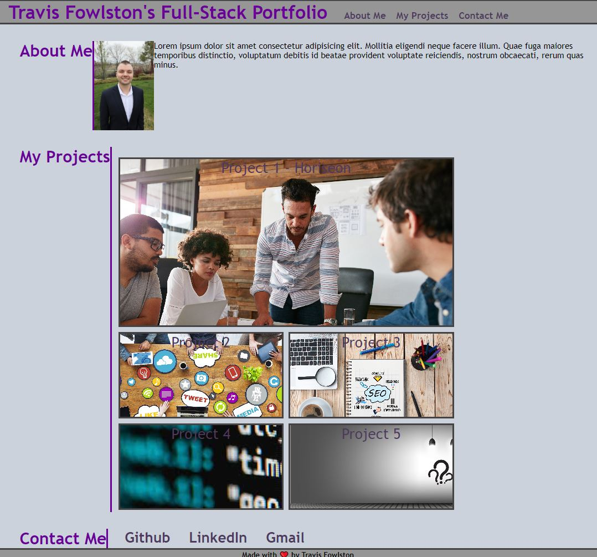

# Module-2-Challenge - Professional Portfolio

## Project Description

The Module 2 Challenge objective was to create a professional portfolio so that as a hring manager, I can review samples of their work and assess whether they're a good candidate for an open position.

## Deployment Screenshot

[Deployment Link](https://travisfowlston.github.io/Module-2-Challenge-Professional-Portfolio/)

## Comments

- Created a index.html file and added a header with navigation, a main section to show the About Me, My Projects, and Contact me, along with a footer.
- Created a style.css file to give the index.html function and aesthetics.
- Made the first project larger than the others along with a link to that deployed project.
- Created a new webpage title.

## Credits

- Filler pictures were take from the Module 1 Challenge by the UC Davis Bootcamp.
- Portfolio was completed by Travis Fowlston.

## License

N/A
